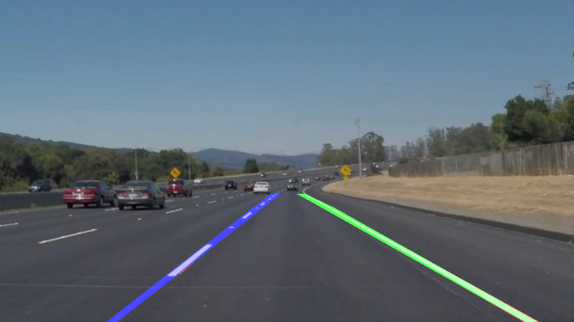
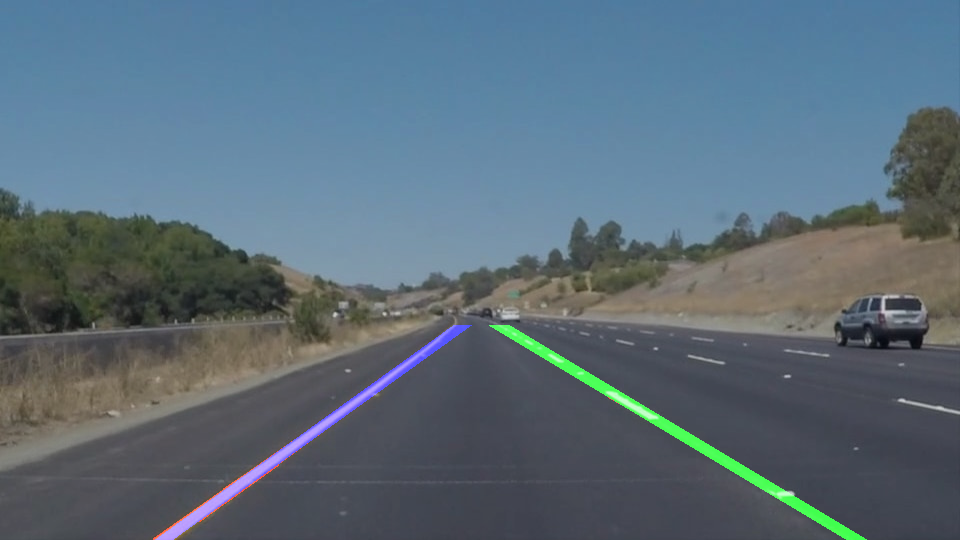
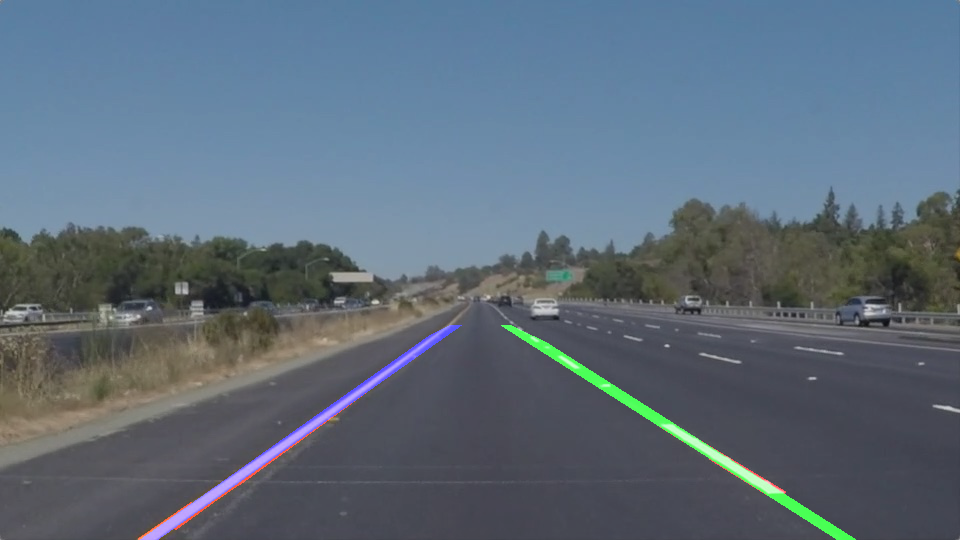
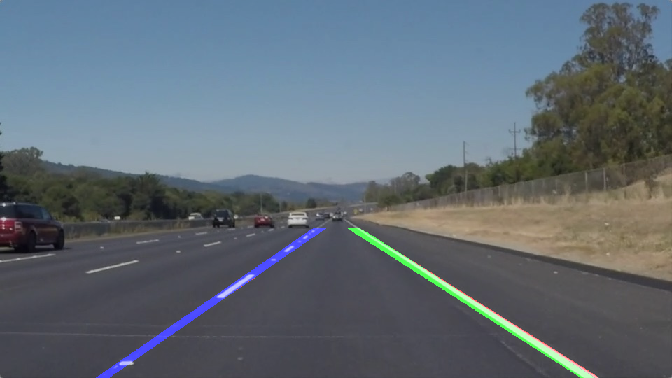
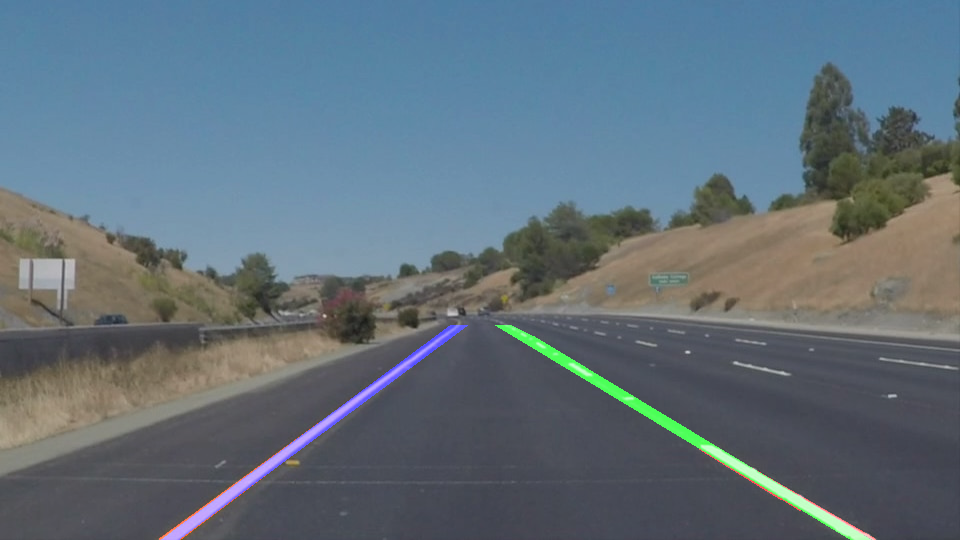
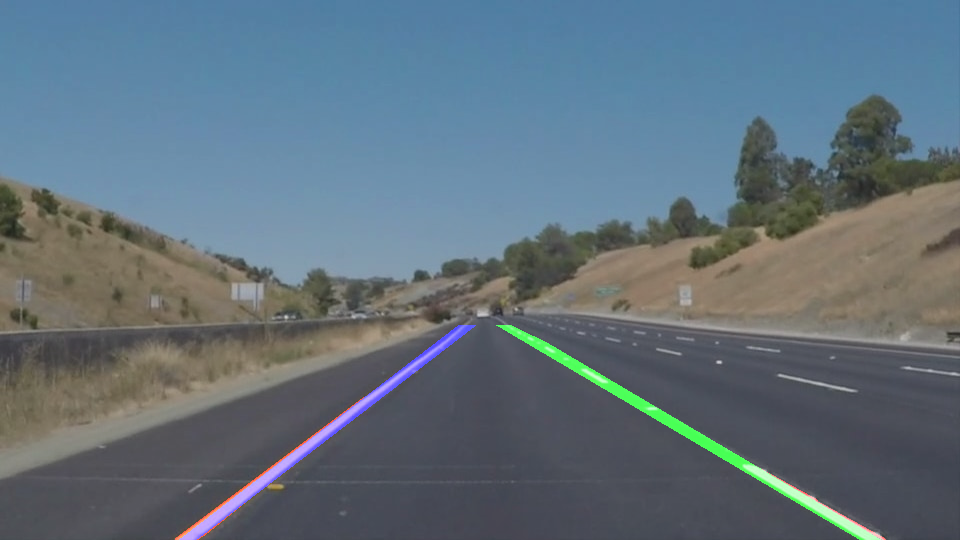

# **Finding Lane Lines on the Road** 

## Writeup

### How the pipeline was implemented, shortcomings, and possible enhancements

My pipeline started with steps as directed during the lessons; after a preliminary call to blur (that would be in addition to the blurring performed by the canny algorithm), the code then calls the canny edge detection, strips out all the area defined by a trapezoid, which overestimates where the road is meant to be in the images, and pass the output to hough_lines.
With the provided implementation of draw_lines, and a little of trial-and-error to tune the paramenters, the output was already quite acceptable on the example images.
Also the execution of the code in that state against the first video performed quite well.
I then moved into reimplementing draw_lines to extrapolate the two lane lines; I purposedly left the drawing of the red lines returned by houghTrasformP() for verification purposes; as suggested by the comment in the method definition, I started with checking the slope inside the loop iterating thru the lines; assigning to left or right lane array (of points) dependening on the sign, and the fitting a line using openCV fitLine call (using blue for left and green for right lane).
The result on the images was good just at this step:

 
 
 

This is the image pipeline, modified to iterate on the available iages and write the output to files:

    for imagepath in os.listdir("test_images/"):
        # clean the caches (wont be used here anyway)
        left_slope_cache.clear()
        right_slope_cache.clear()
        image = mpimg.imread('test_images/'+imagepath)
        height, width = image.shape[:2]
        # blue then erode-dilate
        blurred = gaussian_blur(image,3)
        eroded = cv2.erode(blurred, (3,3))
        blurred = cv2.dilate(eroded, (3,3))
        # call the canny edge detection
        cannyed = canny(blurred, 50, 150)
        # apply the are of interest to the output of canny
        trapezoid = np.array([[0,height],[width/2-30,325],[width/2+30,325],[width,height]])
        regioned = region_of_interest(cannyed, np.int32([trapezoid]))
        # get the hough lines from the canny output
        lined = hough_lines(regioned, 2, 3.14/180, 16, 40, 18)
        # do again to cut the fitted lane lines
        linedregioned = region_of_interest(lined, np.int32([trapezoid]))
        #plt.imshow(linedregioned, cmap='gray')
        # mix the original image with the lines image
        final = weighted_img(linedregioned, image, α=0.8, β=1., λ=0.)
        mpimg.imsave('test_images_output/'+imagepath, final)

Also the output on the first video was acceptable. What I had to amend here was adding a second call to intereseting_region() to crop the area of interest after drawing the lane lines, reusing the same trapezoid as used for canny output, in order to fit them correctly.

Solid white right video output: [first video](test_videos_output/solidWhiteRight.mp4)

The file above is actually what was generated after third pass discussed below, somewhat worse because of the "lazyness" introduced by the cache mean calculation.

### Second Pass

The second video instead was giving some issues, about lines being identified by hough_lines that were not part of the lanes, lines that would be missing on the lanes themselves, generating glitches as the green and blue lane lines being off (not being shown at all for certain frames), or being blatantly mal-positioned. To workaround this effect I first added second pass of gaussian blur at the start of the pipeline: this had no benefits, but no other downsides either on the image output or the first video, so I decided to keep it.

Second attempt was to add a dilate-erode-dilate pass just after the blurring, it is a technique I used past summer on a pet project to facilitate canny identify edges, with somewhat good results before running watershed, but in this case I got no real advance for the second video.

### Third pass

The third attempt was at the same time, in draw_lines, to only include to the left lane array of points, points that would be in the left half of the screen, and likewise for the right lane only points that would be in the right side of the screen. This gave a few good results, but made the challenge video a complete disaster. Decided to tackle the challenge video later and moved to the second change at this stage, which was introducing a top-level double-ended queue instance for the right and left lanes, to be used as a LRU cache for the fitted lines returned by cv2.fitLine(). On any new frame, I calculate the mean and the standard deviation of the fitted lines in cache, and only accept new lines that would be inside a threshold. If no lines are present, just return the most recent fitted line; if the line is accepted or not, return the mean of all the lines in cache (plus some boilerplace checks for corner cases). Note that the caching is parametrized as of number of lines for initialization (before calculating the mean), number of total objects and multiplier for the standard deviation conditional. I have to say I can probably find better values for the parameters with more time, but in any case, in a mature implementation those would need to be computed given the number of frames per second in the video. 

This is the commented draw_lines:

    def draw_lines(img, lines, color=[255, 0, 0], thickness=2):
        # size the frame
        rows,cols = img.shape[:2]
        # declare the two line arrays for the lanes
        left_lines = []
        right_lines = []
        for line in lines:
            for x1,y1,x2,y2 in line:
                # draw the hough line in red
                cv2.line(img, (x1, y1), (x2, y2), color, thickness)
                # add to the right lane if slope sign is positive and the a point is on the right side
                if ( ((y2-y1)/(x2-x1)) >= 0 and x2 > cols / 2):
                    right_lines.append([x1,y1])
                    right_lines.append([x2,y2])
                # or to the left lane otherwise
                elif ( ((y2-y1)/(x2-x1)) < 0 and x2 < cols / 2):
                    left_lines.append([x1,y1])
                    left_lines.append([x2,y2])
                # or discard
        # call into the extracted method which works on the queue and returns the mean        
        [lvx,lvy,lx,ly] = average_slope(left_lines, left_slope_cache,12,3,20)
        # convert to image coordinates
        llefty = int((-lx*lvy/lvx) + ly)
        lrighty = int(((cols-lx)*lvy/lvx)+ly)
        # draw the line in blue, then the same for the other lane, in green
        cv2.line(img,(cols-1,lrighty),(0,llefty),(0,0,255),10)
        [rvx,rvy,rx,ry] = average_slope(right_lines, right_slope_cache,12,3,20)
        rlefty = int((-rx*rvy/rvx) + ry)
        rrighty = int(((cols-rx)*rvy/rvx)+ry)
        cv2.line(img,(cols-1,rrighty),(0,rlefty),(0,255,0),10)

    def average_slope(lines, cache, size=12, mult=3, maxsize=48):
        # this method fits a line in the passed set of points, then computes against the passed cache
        # by accepting the newly fitted one only if inside a threashold
        # size is the number of items to just accept to initialized the queue
        # mult is the multiplier for the standard deviation
        # maxsize is the size of the queue
 
        # ok, if no lines incoming just pop from right, or tell opencv to fit a new line
        if len(lines) > 0:
            [vx,vy,x,y] = cv2.fitLine(np.array(lines, dtype=np.int32), cv2.DIST_L2,0,0.01,0.01)
        else:
            [vx,vy,x,y] = cache.popleft()
        # init mean and std of the queue elements
        mean = np.array([0,0,0,0])
        std = np.array([0,0,0,0])
        # then calculate if the cache is big enough
        if len(cache) > 0:
            mean = np.mean(cache, axis=0)
            std = np.std(cache, axis=0)
        # this array of booleans if for the accept condition
        to_include = abs([vx,vy,x,y] - mean) <= mult * std
        # accept if all the elements are inside the threashold (using any() may be worthy invenstigating)
        #if (len(cache) < size or (to_include[0] and to_include[1])):
        if (len(cache) < size or to_include.all()):
            cache.append([vx,vy,x,y]);
        # pop from the cache is the size hits the boundary
        if (len(cache) > maxsize):
            cache.popleft();
        # this is what to return (using a weighted mean on the indexes of the items here would be much better)
        [vx,vy,x,y] = np.mean(cache, axis=0)
        return [vx,vy,x,y]
    
And this is the pipeline:

    def process_image(image):
        # get image size
        height, width = image.shape[:2]
        # two blur passes with 3x3 kernel
        blurred = gaussian_blur(image,3)
        blurred = gaussian_blur(blurred,3)
        # erode-dilate pass
        eroded = cv2.erode(blurred, (3,3))
        blurred = cv2.dilate(eroded, (3,3))
        # canny
        cannyed = canny(blurred, 50, 150)
        # this defined the are of intereset
        trapezoid = np.array([[30,height],[width/2-20,325],[width/2+20,325],[width-30,height]])
        # while this is for cutting the fitted lane lanes correctly
        trapezoid2 = np.array([[0,height],[0,325],[width,325],[width,height]])
        regioned = region_of_interest(cannyed, np.int32([trapezoid]))
        # call hougTrasnformP with 2 pixel and 1 degree resolution, 16 votes, min lenght 40 and 18 max separation
        lined = hough_lines(regioned, 2, 3.14/180, 16, 40, 18)
        linedregioned = region_of_interest(lined, np.int32([trapezoid2]))
        # combine the lines with the original frame
        result = weighted_img(linedregioned, image, α=0.8, β=1., λ=0.)
        return result

That latest change fixed the problem of missing lanes in certain frames, and also the problem of lanes drawn completely off place; unfortunately, it introduced some level of "lazyness", making the fitted lines follow the hough lines with some retard. This could have very detrimental effects in a real self driving car I guess, nevertheless, I think that the values could still be found so that the response time would still be much better that an human driver; or as an even better solution, instead of calculating the mean, I could calculate a weighted mean using the queue index as the weight, so that more recent frames slope would have more weight than older ones; unfortunately I couldn't find a way in python to easily get this result.

Solid yellow left video output: [solid yellow left, a bit more tricky one](test_videos_output/solidYellowLeft.mp4)

### Considerations on the pipeline failing against the challenge video

Next, the challenge video. It was still a disaster because a big number of hough lines was found, that were unexpected. I believe a possible fix is determining a better interesting area, by using the intersection of the two extrapolated lane lines as the top side of the trapzoid used for selecting the interesting area. I started to implement that but could not get to it in time before the deadline.  

Another possible solution would trying to apply a threshold twice to the frame (with BINARY and BINARY_INVERTED) in roder to try to separate the foreground from the background, then work on the background only (which I belive would contain the road and the sky, but couldn't verify that in time).

Challenge video output: [challenge...](test_videos_output/challenge.mp4)

